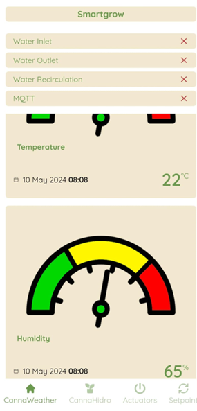

## SmartGrow DataControl User Guide: A Comprehensive Manual

## About Smartgrow
## SmartGrow DataControl is a highly automated program developed specifically for collecting and evaluating ambient physiological information in indoor crop cultivation. This solution enables effortless integration between wireless devices and open-source databases, prioritizing the optimization of energy consumption by utilizing standard communication protocols such as TCP/IP, MQTT, and HTTP. The main objective of SmartGrow DataControl is to enhance the collection of crucial data for in-depth research of crop physiology, utilizing cutting-edge optics and Internet of Things (IoT) technologies. This paper primarily functions as a user guide, providing precise instructions on how to efficiently utilize the program. The content encompasses subjects such as the process of installation, the necessary hardware and software prerequisites, and the functionality of the system.
## GitHub repository
<https://github.com/aeccitm/smartgrow_data_control.git>

Installation Process  

SmartGrow was initially developed as a web-based program, providing customers with two distinct options for installation and usage. The first approach entails a local installation, in which the application functions within a network environment that restricts access to devices linked within that network. 

The second method entails deploying the software onto a web server, which requires the following explanation of the deployment process. Using this configuration, users who have the necessary network infrastructure can remotely access the program through the internet, allowing for convenient usage from almost anywhere.

System requirements

*Operative system*

Smartgrow was designed to be compatible with any operating system that can open a web browser. Nevertheless, we strongly advise utilizing an Ubuntu operating system to facilitate the installation procedure. The interoperability and user-friendly interface of Ubuntu simplify the setup procedure, guaranteeing a more seamless experience for users.

*Software requirements*

To install and utilize Smartgrow, the user must fulfill the following software requirements:

1. Install and set up Docker Compose on your local PC or web server. We recommend that you follow Docker Compose's official installation and configuration guide for your operating system. Because installation procedures can vary over time, it is advisable to use the most recent documentation available at the time of installation. However, Appendix A of this user guide contains instructions for installing Docker Compose version 2.24.3 (which was used for testing) on Ubuntu 22.04 LTS. Additionally, Appendix B contains instructions for installing the same version of Docker Compose on a Windows 11 operating system.
1. Install and configure Git (Appendix C).
1. If the user's operating system is Windows 11, they must additionally install and setup WSL 2. Appendix D of this user guide describes how to install WSL 2 on a Windows 11 operating system.

*Steps for Installation or Deployment*

1. Open Docker Desktop (only for Windows 11) and confirm that the Docker engine is operating. The user can confirm this by looking in the bottom left corner of the Docker Desktop window for a green indication with the phrase "Engine running," as illustrated in Figure 1.

   

   **Figure 1.** Docker Desktop

1. Launch WSL (Windows 11) or the terminal (Ubuntu 22.04 LTS) and proceed to clone the GitHub repository into the desired directory. To accomplish this task, the user can employ the subsequent command:

 

- ***git clone https://github.com/aeccitm/smartgrow_data_control.git***

Prior to executing the above command, it is crucial for the user to have Git installed and properly configured on their local computer or web server. If the user does not have Git installed, they can refer to the installation and configuration guide provided in Appendix C of this user guide.

1. Go to the directory where the project is stored and then enter the backend directory by executing the following command:

 

- ***cd smartgrow/backend***

1. Generate a file called ***.env*** and access it using the nano text editor. To achieve this, the user can use the following commands: 

- ***touch .env***
- ***nano .env***

1. Copy and paste the following content into the ***.env*** file, and then save the changes:

***# Mongo***

***MONGO\_DB = 'smartgrow'***

***MONGO\_HOST = my-database***

***MONGO\_PORT = 27017***

***MONGO\_INITDB\_ROOT\_USERNAME = 'smartgrow'***

***MONGO\_INITDB\_ROOT\_PASSWORD = 'smartgrow1234'***

***MONGO\_CONNECTION = 'mongodb'***

***# MQTT***

***MQTT\_HOST = emqx***

***MQTT\_PORT = 1883***

To save changes and exit the text editor, the user should press the **Ctrl + X** keys, then confirm the changes with **Y**, and finally press **Enter**.

1. Return to the main directory of the project by using the following command: 

- ***cd ..***

1. To deploy the database, execute the command shown in Figure 2:

- ***sudo docker compose up -d my-database***

1. To deploy the MQTT server, use the command shown in Figure 3:

- ***sudo docker compose up -d emqx***

1. ` `To deploy the application backend, execute the command shown in Figure 4:

- ***sudo docker compose up -d backend***

To confirm the successful deployment, the user can open a web browser and enter the ***URL: localhost:3000***. The phrase "*Hello World!*" should be shown (see to Figure 5).

**Figure 2.** docker-compose up

**Figure 3.** docker ps -a

**Figure 4.** container running docker

**Figure 5.** Hello word web 

1. Access the frontend directory by executing the provided command: 

- ***cd frontend***

1. Generate a file called ***.env*** and access it using the nano text editor. In order to do this task, the user can employ the following commands:

- ***touch .env***
- ***nano .env***

1. Copy and paste the following content into the ***.env*** file, then save the changes:

***VITE\_BROKER\_MQTT = ws://localhost:8083/mqtt***

***VITE\_BACKED\_URL = [http://localhost:3000***](http://localhost:3000)***

1. To save modifications and exit the text editor, the user needs simultaneously press the **Ctrl + X** keys, subsequently confirm the alterations by pressing **Y**, and ultimately press the **Enter** key.

1. Return to the main directory of the project by executing the following command: 

- ***cd ..***

1. Execute the following command to deploy the application frontend:

- ***sudo docker compose up -d frontend***

1. To confirm the successful deployment, the user can simply open a web browser and enter the following ***URL: localhost:8080***. The application's homepage should be displayed.

**Figure 6.** Homepage of SmartGrow DataControl peloyed in a web browser.

.

To execute the application on a Windows operating system, the user must initially launch Docker Desktop. Next, navigate to the left menu and choose the "Containers" option. Find the container named "appsmartgrow" and choose the "Start" option or click the play button located under the "Actions" section. This will start the application.

**Figure 7.** Docker desktop images

Alternatively, the software can be executed on both Windows and Ubuntu by running the following command in the terminal, which is placed in the root directory of the project:

- ***sudo docker compose up -d***

Software functionalities

The integration of SmartGrow DataControl components culminates in a cohesive system distinguished by its adaptability and expansiveness. This system orchestrates data acquisition, communicates with microcontrollers, interfaces with cloud-based services, and governs actuators within the growth chamber, all seamlessly orchestrated through its backend component. By incorporating standardized communication protocols like MQTT and HTTP, SmartGrow DataControl ensures broad compatibility with diverse microcontrollers. These characteristic underscores the system's versatility, which can be tailored to accommodate an array of crop varieties. The open-source nature of this software offers several key advantages. Firstly, it fosters collaboration among developers and users globally, leading to continuous innovation and improvement. Secondly, its transparency allows users to verify its security and reliability, building trust and confidence. Additionally, its flexibility enables customization to meet specific needs and seamless integration with other tools and systems.

Potential applications of Smartgrow DataControl include:

1. It helps environmental control and real-time data collection for dynamic production adjustments in indoor farming and vertical farms. Furthermore, it enables meticulous regulation of environmental factors such as temperature, humidity, and light intensity, guaranteeing ideal conditions for growth and improving agricultural productivity.
1. It provides significant could be used to evaluate the response of different genotypes to diverse environmental situations, offering crucial data to aid in the development of adaptive crop varieties. Through the surveillance and examination of the performance of different genetic strains under carefully regulated environmental conditions, scientists can detect characteristics that provide durability and enhance the ability for maximum production.
1. It collects comprehensive data on plant growth in controlled environments, allowing analysis using artificial intelligence to enhance cultivation techniques. Researchers can obtain significant insights into how crops respond to certain environmental circumstances by continuously checking several phenotypic parameters, such as plant height, leaf size, and fruit yield.

Technology Stack

- JavaScript
- Node.js
- Nest.js
- MongoDB
- MQTT
- Docker
- React.js
- Tailwind CSS

Software operation

To observe current environmental factors, users need to visit the homepage of Smartgrow DataControl. Users can browse between the Hidro and Weather tabs using the navigation menu. On larger displays, the menu is positioned at the top, while on smaller devices like mobile phones, it is located at the bottom. Within these areas, users will have access to up-to-date measurements of environmental parameters including temperature, humidity, carbon dioxide levels, photosynthetic photon flux (PPF), vapor pressure deficit (VPD), photosynthetic photon flux density (PPFD), water temperature, pH, electrical conductivity, and water level. Furthermore, users could see the precise date and time of the most recent data recorded as is shown in figures 8, 9, and 10.

**Figure 8.**  Weather tab selection by the user

**Figure 9.** Hidro Tab selection by the user

**Figure 10.** Responsive mobile version for CannaHidro table selection

On the other hand, users can check the state of the system's actuators by viewing indicators positioned in the top-right corner for bigger screens and at the top for smaller screens. Users may visually determine the status of the actuators, whether they are in an activated or deactivated state. In addition, users could monitor the state of the system's connections as is illustrated in Figure 11.

**Figure 11.** Smartgrow DataControl allows to monitor the state of the system's connections as is highlighted in the top of this image.

Users can access the "Actuators" tab from the navigation menu, which is positioned at the top for bigger screens and at the bottom for mobile screens, to interact with the system's actuators. Within this tab, users could observe the current state of the system's actuators, which are visually depicted as toggle buttons. Users could modify the operational status of the system's actuators by activating or deactivating them as is depicted in Figure 12.

**Figure 12.** Picture of the actuator tab in which the user can observe the current state of the system's actuators.

To interact with the pH and conductivity control system, users can visit the "Control" tab from the navigation menu. On bigger screens, the menu is situated at the top, while on mobile screens, it is located at the bottom. Within this section, users have the ability to observe the present target values for pH and conductivity. Furthermore, users have the ability to customize them according to their preferences and transmit them to the control system as is illustrated in Figure 13.

**Figure 13.** Picture of the Control tab in which the user can observe the present target values for pH and conductivity.

## Appendix A: Docker Compose Installation on Ubuntu 22.04 LTS

## To create this installation guide, we utilized the documentation available on the official Digital Ocean page. For further information, users can refer to the following links:
## **How to Install and Use Docker on Ubuntu 22.04:** <https://www.digitalocean.com/community/tutorials/how-to-install-and-use-docker-on-ubuntu-22-04> 
## **How to Install and Use Docker Compose on Ubuntu 22.04:** <https://www.digitalocean.com/community/tutorials/how-to-install-and-use-docker-compose-on-ubuntu-22-04> 

Before installing Docker Compose on Ubuntu 22.04 LTS, users must have Docker installed and configured on their local computer or web server. Follow these steps: 

1. Update the operating system and installed packages. Use the following commands:

- ***sudo apt update***
- ***sudo apt upgrade***

1. Install the necessary packages to enable apt to use a repository over HTTPS:

- ***sudo apt install apt-transport-https ca-certificates curl software-properties-common***

1. Add the official Docker GPG key to the system:

- ***curl -fsSL https://download.docker.com/linux/ubuntu/gpg | sudo gpg --dearmor -o /usr/share/keyrings/docker-archive-keyring.gpg***

1. Configure the stable Docker repository. For this, the user can use the following command:

- ***echo "deb [arch=amd64 signed-by=/usr/share/keyrings/docker-archive-keyring.gpg] https://download.docker.com/linux/ubuntu $(lsb\_release -cs) stable" | sudo tee /etc/apt/sources.list.d/docker.list > /dev/null***

1. Update the operating system and the packages installed on the system. For this, the user can use the following commands:

- ***sudo apt update***
- ***sudo apt upgrade***

1. Install Docker on the system. For this, the user can use the following command:

- ***sudo apt install docker-ce***

1. Verify that Docker has been installed correctly. For this, the user can use the following command:

- ***sudo systemctl status docker***

Once Docker is installed on Ubuntu 22.04 LTS, you can proceed with the installation of Docker Compose on your local computer or server. Follow the following steps:

1. Obtain the most up-to-date and reliable version of Docker Compose by downloading it. To obtain the most recent stable release of Docker Compose, utilize the subsequent command:

- ***mkdir -p ~/.docker/cli-plugins/***
- ***curl -SL https://github.com/docker/compose/releases/download/v2.3.3/docker-compose-linux-x86\_64 -o ~/.docker/cli-plugins/docker-compose*** 

1. Grant executes rights to the downloaded Docker Compose file by executing the following command:

- ***chmod +x ~/.docker/cli-plugins/docker-compose***

1. Verify Docker Compose Installation. Once Docker Compose has been installed, verify its installation by running the following command:

- ***docker compose –version***

By following these instructions, you'll have Docker and Docker Compose installed and ready to use on your Ubuntu 22.04 LTS system.

Appendix B: Installing Docker Compose on Windows 11

To install Docker Compose on Windows 11, users can install Docker Desktop. Follow these steps:

1. Visit the official Docker website to download the Docker Desktop installer. Users can access the installer from the following link:

   <https://www.docker.com/products/docker-desktop>

1. Execute the downloaded Docker Desktop installer and follow the prompts provided by the installation wizard.
1. Once you have installed Docker Desktop, open the application, and patiently wait for the Docker engine to initiate and begin running.
1. To set up Docker Desktop to utilize WSL 2, follow to the following instructions:
   1. Click on the Docker Desktop icon situated in the system tray.
   1. Choose the "Settings" option.
   1. Select the option labeled "Resources."
   1. Select the option labeled "WSL Integration."
   1. Select the checkbox for "Enable integration with my default Windows Subsystem for Linux (WSL) distribution."
   1. Click on the "General" tab and choose the option "Use the WSL 2 based engine."
   1. Select the option "Apply & Restart" and click on it.

Appendix C: Installing and Configuring Git

To install Git on Ubuntu 22.04 LTS, users can utilize the following command:

- ***sudo apt install git***

Once Git is installed, it needs to be configured with the following commands:

- ***git config --global user.name "Your Name" ("Please include your name")*** 
- ***git config --global user.email " (“Please include your email <your@email.com>”)***

To create an SSH key in Ubuntu 22.04 LTS and add it to the SSH agent, users can execute the following commands:

- ***ssh-keygen -t rsa -b 4096 -C "your@email.com"***

To add the SSH key to the SSH agent in Ubuntu 22.04 LTS, the user can use the following:

- ***eval "$(ssh-agent -s)"***
- ***ssh-add ~/.ssh/id\_rsa***

To view the generated SSH key in Ubuntu 22.04 LTS, users can use the following command:

- ***cat ~/.ssh/id\_rsa.pub***

Once the SSH key is generated, users should add it to their GitHub account by following these steps:

1. Log in to your GitHub account.
1. Click on your profile picture and select "Settings".
1. Select "SSH and GPG keys".
1. Click on "New SSH key".
1. Paste the SSH key into the "Key" field and give it a name.
1. Click on "Add SSH key".
1. Confirm the action by entering your GitHub password.

## Appendix D: Installing WSL

To install WSL 2 on Windows 11, users can follow the procedures below:

1. Open the Microsoft Store.
1. Search for the Windows Subsystem for Linux program.
1. Select the Install option.
1. Wait for the installation to be completed.
1. Search for the Ubuntu application.
1. Select the Install option.
1. Wait for the installation to be completed.
1. Look for the Windows Terminal application.
1. Select the Install option.
1. Wait for the installation to be completed.
1. Launch the Windows Terminal application.

After opening the Windows Terminal application, users must setup Ubuntu. To accomplish this, take these steps:

1. Launch the Windows Terminal application.
1. Click on the downward arrow option in the upper left corner of the window.
1. Select the Settings option.
1. Click on the Default Profile option.
1. Click on the Ubuntu option.
1. Click the Save button.
1. Restart the Windows Terminal app.

<!-- 
[ref1]: images/Aspose.Words.b81a03c4-a76f-4a05-81f2-a2d699f88a08.008.png -->
